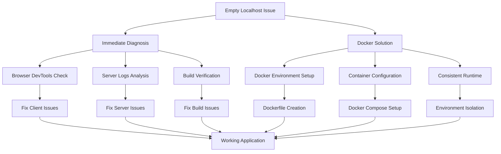

# Design Document - Fix Empty Localhost Issue

## Overview

This design outlines a systematic approach to diagnose and resolve the empty localhost issue in the FoodCompare application. The solution includes both immediate debugging steps and a Docker-based approach for consistent environment setup.

## Architecture

### Problem Analysis Framework

The empty localhost issue can stem from several potential causes:

1. **Client-side rendering issues**: React hydration problems, JavaScript errors
2. **Server-side rendering failures**: Next.js SSR/SSG compilation issues  
3. **Build configuration problems**: Webpack, TypeScript, or Tailwind CSS issues
4. **Environment inconsistencies**: Node.js version, dependency conflicts
5. **Network/routing issues**: Custom server configuration problems

### Solution Architecture



## Components and Interfaces

### 1. Diagnostic Component

**Purpose**: Systematically identify the root cause of the empty page issue

**Key Functions**:
- Browser console error analysis
- Network request inspection
- React component tree verification
- Server log examination

**Interface**:
```typescript
interface DiagnosticResult {
  browserErrors: string[];
  networkIssues: string[];
  serverErrors: string[];
  buildStatus: 'success' | 'failed' | 'warnings';
  recommendations: string[];
}
```

### 2. Docker Environment Component

**Purpose**: Provide consistent, isolated runtime environment

**Key Functions**:
- Containerized Next.js application
- Consistent Node.js version
- Isolated dependency management
- Port mapping and networking

**Configuration**:
```dockerfile
FROM node:18-alpine
WORKDIR /app
COPY package*.json ./
RUN npm ci --only=production
COPY . .
RUN npm run build
EXPOSE 3000
CMD ["npm", "start"]
```

### 3. Development Server Component

**Purpose**: Ensure proper server configuration and startup

**Key Functions**:
- Custom server with Socket.IO integration
- Proper Next.js app initialization
- Error handling and logging
- Port management

### 4. Build Verification Component

**Purpose**: Validate build process and asset generation

**Key Functions**:
- TypeScript compilation verification
- Tailwind CSS processing
- Asset bundling validation
- Static file generation

## Data Models

### Environment Configuration
```typescript
interface EnvironmentConfig {
  nodeVersion: string;
  npmVersion: string;
  dependencies: Record<string, string>;
  environmentVariables: Record<string, string>;
  buildSettings: {
    typescript: boolean;
    tailwind: boolean;
    nextjs: string;
  };
}
```

### Diagnostic Report
```typescript
interface DiagnosticReport {
  timestamp: string;
  environment: EnvironmentConfig;
  issues: {
    critical: string[];
    warnings: string[];
    suggestions: string[];
  };
  solutions: {
    immediate: string[];
    docker: string[];
    alternative: string[];
  };
}
```

## Error Handling

### Client-Side Error Boundaries
- React Error Boundary components for graceful failure handling
- Fallback UI components for failed renders
- Error reporting to console with actionable information

### Server-Side Error Handling
- Comprehensive error logging in custom server
- Graceful degradation for Socket.IO failures
- Clear error messages for development environment

### Build Error Resolution
- TypeScript compilation error fixes
- Dependency resolution strategies
- Asset loading failure handling

## Testing Strategy

### 1. Environment Testing
- Verify Node.js and npm versions
- Test dependency installation
- Validate environment variable loading

### 2. Build Testing
- Test production build process
- Verify static asset generation
- Validate TypeScript compilation

### 3. Runtime Testing
- Test server startup process
- Verify page rendering in browser
- Test navigation between routes

### 4. Docker Testing
- Test container build process
- Verify application startup in container
- Test port mapping and accessibility

## Docker Implementation Strategy

### Phase 1: Basic Containerization
1. Create Dockerfile with Node.js 18 Alpine base
2. Configure proper working directory and file copying
3. Install dependencies and build application
4. Set up proper port exposure and startup command

### Phase 2: Development Environment
1. Create docker-compose.yml for development
2. Configure volume mounting for live reload
3. Set up environment variable management
4. Configure networking for Socket.IO

### Phase 3: Production Optimization
1. Multi-stage Docker build for smaller images
2. Optimize layer caching for faster builds
3. Configure health checks and monitoring
4. Set up proper logging and error handling

## Implementation Approach

### Immediate Fixes (Non-Docker)
1. **Browser Inspection**: Check console for JavaScript errors
2. **Network Analysis**: Verify all assets are loading correctly
3. **Server Logs**: Examine server output for compilation errors
4. **Build Verification**: Ensure build process completes successfully
5. **Component Testing**: Verify React components are mounting

### Docker Solution Implementation
1. **Environment Setup**: Create Dockerfile and docker-compose.yml
2. **Dependency Management**: Ensure consistent package versions
3. **Build Process**: Containerize the build and runtime environment
4. **Port Configuration**: Properly map container ports to host
5. **Volume Management**: Set up development volume mounting

### Fallback Strategies
1. **Fresh Installation**: Clean node_modules and reinstall
2. **Version Rollback**: Test with different Node.js versions
3. **Minimal Setup**: Create minimal working Next.js app to isolate issues
4. **Alternative Servers**: Test with standard Next.js dev server

## Success Criteria

1. **Immediate Success**: Application loads correctly on localhost:3000
2. **Navigation Success**: All routes render properly without errors
3. **Feature Success**: Core functionality (search, compare) works as expected
4. **Docker Success**: Application runs consistently in containerized environment
5. **Development Success**: Hot reload and development features work properly